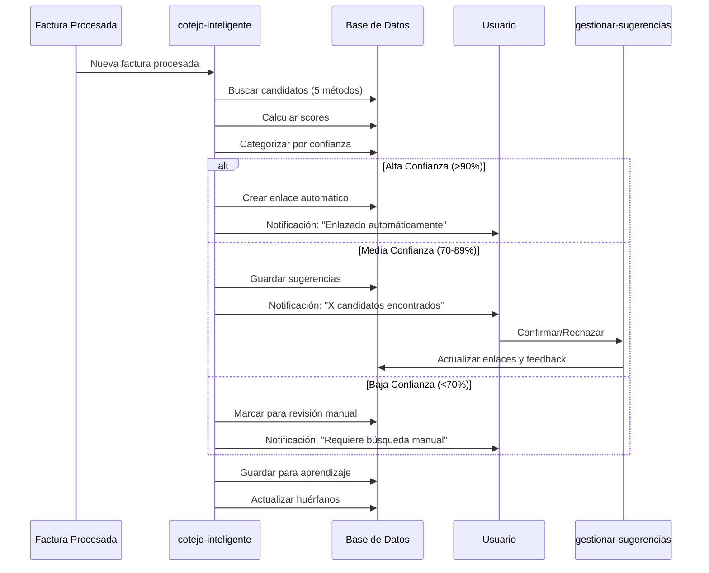

# 🔗 SISTEMA DE COTEJO INTELIGENTE DE FACTURAS Y ALBARANES

## 📋 RESUMEN EJECUTIVO

### **PROBLEMA**
Los restaurantes reciben albaranes de entregas que posteriormente se consolidan en facturas. El proceso manual de identificar qué albaranes corresponden a cada factura es:
- ⏰ **Lento y tedioso** (horas de trabajo administrativo)
- ❌ **Propenso a errores** (albaranes perdidos, duplicaciones)
- 💸 **Costoso en tiempo** (personal dedicado exclusivamente a esta tarea)
- 📊 **Dificulta el control** de inventarios y costes reales

### **SOLUCIÓN**
Sistema de cotejo automático e inteligente que:
- 🤖 **Detecta automáticamente** las relaciones entre facturas y albaranes
- 🎯 **Aprende de las decisiones** del usuario para mejorar continuamente
- 🔔 **Notifica siempre** el resultado del cotejo
- 🛡️ **Garantiza que ningún albarán** se quede sin procesar

### **VALOR**
- **Reducción 90%** del tiempo dedicado a cotejo manual
- **Eliminación** de albaranes "perdidos" o no facturados
- **Visibilidad completa** del flujo documental
- **Base sólida** para control de costes e inventarios

---

## 🎯 OBJETIVOS DEL SISTEMA

### **OBJETIVO PRIMARIO**
**Enlazar automáticamente cada factura con sus albaranes correspondientes** con mínima intervención humana y máxima precisión.

### **OBJETIVOS SECUNDARIOS**
1. **Notificación universal**: Cada factura procesada genera una notificación de cotejo
2. **Sugerencias inteligentes**: Mostrar candidatos probables cuando hay dudas
3. **Gestión de huérfanos**: Identificar y gestionar albaranes sin factura
4. **Aprendizaje continuo**: Mejorar precisión basándose en feedback del usuario

---

## 🏗️ ARQUITECTURA DE LA SOLUCIÓN

### **COMPONENTES PRINCIPALES**

#### **1. EDGE FUNCTION DE COTEJO (`cotejo-inteligente`)**
**Nueva edge function independiente** que se ejecutará después del procesamiento de cada factura.

**Responsabilidades:**
- Análisis multi-método de candidatos
- Cálculo de probabilidades de match
- Generación de enlaces automáticos
- Creación de notificaciones inteligentes

#### **2. MOTOR DE BÚSQUEDA MULTI-NIVEL**
**Sistema de 5 métodos de detección en cascada:**

1. **Referencias Explícitas (95% confianza)**
   - Detectar "ALB-12345" en productos de la factura
   - Buscar números idénticos entre factura y albarán
   - Analizar observaciones y campos de texto libre

2. **Proximidad Temporal + Proveedor (85% confianza)**
   - Mismo proveedor + fecha coherente (albarán antes que factura)
   - Importes similares (tolerancia ±20%)
   - Ventana temporal máxima: 45 días

3. **Análisis de Productos (75% confianza)**
   - Comparación de listas de productos
   - Uso de embeddings para productos similares
   - Detección de subconjuntos (albarán parcial)

4. **Patrones Temporales (60% confianza)**
   - Periodicidad detectada del proveedor
   - Acumulación de albaranes pendientes
   - Ventanas temporales aprendidas

5. **Última Oportunidad (40% confianza)**
   - Albaranes huérfanos del mismo proveedor
   - Combinaciones de importes que sumen el total
   - Rango temporal ampliado (90 días)

#### **3. SISTEMA DE APRENDIZAJE CONTINUO**
- **Registro de decisiones**: Cada validación/rechazo del usuario se almacena
- **Ajuste de pesos**: Los algoritmos se optimizan según efectividad real
- **Patrones específicos**: Aprendizaje por restaurante y proveedor
- **Análisis semanal**: Optimización automática de parámetros

#### **4. INTERFAZ DE NOTIFICACIONES Y GESTIÓN**
- **Notificaciones inmediatas** para cada cotejo realizado
- **Dashboard de pendientes** con sugerencias priorizadas
- **Gestión de huérfanos** con alertas proactivas
- **Herramientas de búsqueda manual** para casos complejos

---

## 🔄 FLUJO DE PROCESAMIENTO

### **SECUENCIA AUTOMÁTICA**

```
📄 Factura procesada con IA
      ↓
🔍 ACTIVAR edge function cotejo-inteligente
      ↓
🧠 Ejecutar 5 métodos de búsqueda en paralelo
      ↓
📊 Consolidar resultados y calcular confianzas
      ↓
🎯 Categorizar según nivel de confianza:
      ↓
┌─────────────────────────────────────────┐
│ 🟢 ALTA (>90%)  → Enlace automático     │
│ 🟡 MEDIA (70-89%) → Mostrar sugerencias │
│ 🔴 BAJA (<70%)   → Revisión manual      │
│ ⚪ SIN ALBARÁN   → Factura directa      │
└─────────────────────────────────────────┘
      ↓
🔔 GENERAR notificación SIEMPRE
      ↓
📝 Registrar en BD para aprendizaje
      ↓
✅ Proceso completado
```

### **TIPOS DE NOTIFICACIONES**

#### **🟢 Alta Confianza - Enlace Automático**
```
✅ COTEJO AUTOMÁTICO
📄 FAC-12345 - García S.L. - €1,250.30
📦 Enlazada automáticamente con ALB-12345
🎯 Confianza: 96% (referencia explícita)
```

#### **🟡 Media Confianza - Sugerencias**
```
⚠️ COTEJO CON SUGERENCIAS
📄 FAC-67890 - Norte Distribución - €890.15
📦 Encontré 2 candidatos probables:
   • ALB-001 - €445.20 (85% match)
   • ALB-002 - €444.95 (82% match)
[REVISAR CANDIDATOS]
```

#### **🔴 Baja Confianza - Manual**
```
🔍 COTEJO MANUAL REQUERIDO
📄 FAC-99999 - López Alimentación - €340.50
❓ No encontré candidatos obvios
[BUSCAR MANUALMENTE]
```

#### **⚪ Sin Albarán - Factura Directa**
```
📄 FACTURA DIRECTA
📄 FAC-77777 - Servicios TechCorp - €120.00
ℹ️ Marcada como factura directa (sin albarán)
```

---

## 🗄️ ESTRUCTURA DE DATOS

### **NUEVAS TABLAS REQUERIDAS**

#### **Tabla Principal de Enlaces**
```sql
facturas_albaranes_cotejo (
  factura_id UUID,
  albaran_id UUID,
  metodo_deteccion VARCHAR(50),
  confianza_match NUMERIC(3,2),
  estado VARCHAR(20), -- 'automatico', 'sugerido', 'confirmado', 'rechazado'
  usuario_validacion UUID,
  fecha_cotejo TIMESTAMP
)
```

#### **Tabla de Aprendizaje**
```sql
cotejo_feedback (
  enlace_id UUID,
  accion_usuario VARCHAR(20), -- 'confirmado', 'rechazado', 'corregido'
  contexto_decision JSONB,
  timestamp TIMESTAMP
)
```

#### **Tabla de Huérfanos**
```sql
documentos_huerfanos (
  documento_id UUID,
  tipo_documento VARCHAR(20), -- 'factura', 'albaran'
  dias_sin_enlace INTEGER,
  estado VARCHAR(20), -- 'pendiente', 'factura_directa', 'ignorado'
  fecha_deteccion TIMESTAMP
)
```

---

## 🚀 PLAN DE IMPLEMENTACIÓN

### **FASE 1: NÚCLEO DEL SISTEMA (Semana 1-2)**
**Objetivo**: Sistema básico funcional

1. **Crear edge function `cotejo-inteligente`**
   - Métodos 1 y 2 (referencias explícitas + proximidad temporal)
   - Categorización básica por confianza
   - Notificaciones simples

2. **Integración en flujo existente**
   - Llamada automática después de `process-invoice`
   - Estructura de BD básica
   - Registro de decisiones

3. **Interfaz mínima**
   - Notificaciones de cotejo
   - Lista de sugerencias pendientes
   - Acciones básicas (confirmar/rechazar)

### **FASE 2: INTELIGENCIA AVANZADA (Semana 3-4)**
**Objetivo**: Mejorar precisión y automatización

1. **Métodos avanzados de detección**
   - Análisis de productos (Método 3)
   - Patrones temporales (Método 4)
   - Búsqueda embeddings

2. **Sistema de aprendizaje**
   - Registro de feedback
   - Ajuste automático de pesos
   - Optimización por proveedor

3. **Gestión de huérfanos**
   - Alertas proactivas
   - Identificación automática
   - Herramientas de resolución

### **FASE 3: EXPERIENCIA COMPLETA (Semana 5-6)**
**Objetivo**: Sistema robusto y user-friendly

1. **Interfaz completa**
   - Dashboard de cotejo
   - Herramientas de búsqueda manual
   - Reportes y métricas

2. **Optimizaciones finales**
   - Método 5 (última oportunidad)
   - Predicción de comportamiento
   - Integración WhatsApp para alertas

---

## 📊 MÉTRICAS DE ÉXITO

### **TÉCNICAS**
- **>85% de precisión** en enlaces automáticos
- **<5% de falsos positivos** en alta confianza
- **0% de albaranes perdidos** (sin procesar)
- **<2 segundos** tiempo de procesamiento por factura

### **NEGOCIO**
- **90% reducción** en tiempo de cotejo manual
- **100% visibilidad** de documentación pendiente
- **95% satisfacción** del usuario con sugerencias
- **50% mejora** en control de inventarios

### **APRENDIZAJE**
- **+2% precisión mensual** por aprendizaje automático
- **<30 días** para alcanzar 90% precisión por proveedor nuevo
- **Detección automática** de patrones específicos del restaurante

---

## 🔧 CONSIDERACIONES TÉCNICAS

### **EDGE FUNCTION INDEPENDIENTE**
- **Sí, se requiere nueva edge function** `cotejo-inteligente`
- **Separada de process-invoice** para mantener responsabilidades claras
- **Llamada asíncrona** para no impactar performance de procesamiento
- **Manejo robusto de errores** con fallbacks

### **INTEGRACIÓN CON SISTEMA ACTUAL**
- **Mínima modificación** del flujo existente
- **Compatibilidad total** con facturas ya procesadas
- **Migración gradual** de documentos históricos
- **Backup y rollback** en caso de problemas

### **ESCALABILIDAD**
- **Procesamiento paralelo** de múltiples métodos
- **Cache inteligente** para candidatos frecuentes
- **Optimización automática** basada en volumen
- **Monitoreo proactivo** de performance

---

## 💰 RETORNO DE INVERSIÓN

### **INVERSIÓN ESTIMADA**
- **Desarrollo**: 3-4 semanas de trabajo técnico
- **Testing**: 1 semana de validación con datos reales
- **Despliegue**: Implementación gradual sin downtime

### **BENEFICIOS CUANTIFICABLES**
- **Ahorro de tiempo**: 15-20 horas/semana por restaurante
- **Reducción errores**: Eliminación de albaranes perdidos
- **Mejora control**: Visibilidad completa del flujo documental
- **Diferenciación**: Funcionalidad única en el mercado

### **ROI ESPERADO**
- **Mes 1-2**: Recuperación de inversión en desarrollo
- **Mes 3+**: Beneficio neto continuo
- **Largo plazo**: Ventaja competitiva sostenible

---

## ⚠️ RIESGOS Y MITIGACIONES

### **RIESGO: Falsos positivos en enlaces automáticos**
**Mitigación**: Sistema de confianza conservador + feedback del usuario

### **RIESGO: Complejidad técnica excesiva**
**Mitigación**: Implementación por fases + validación continua

### **RIESGO: Resistencia del usuario a cambios**
**Mitigación**: Beneficios inmediatos visibles + training mínimo requerido

### **RIESGO: Variabilidad entre proveedores**
**Mitigación**: Aprendizaje personalizado por proveedor + flexibilidad en reglas

---

## 🏁 PRÓXIMOS PASOS INMEDIATOS

1. **✅ Aprobación del plan** y asignación de recursos
2. **✅ Creación de edge function** `cotejo-inteligente`
3. **✅ Implementación de métodos** básicos de detección
4. **✅ Testing con facturas reales** del sistema actual
5. **✅ Despliegue gradual** con monitoreo activo

**FECHA OBJETIVO MVP**: 2 semanas
**FECHA OBJETIVO SISTEMA COMPLETO**: 6 semanas


# 🏗️ ARQUITECTURA TÉCNICA - SISTEMA DE COTEJO

## 📋 ÍNDICE
1. [Estructura de Tablas](#tablas)
2. [Edge Functions](#functions)
3. [Flujo de Datos](#flujo)
4. [Relaciones entre Componentes](#relaciones)

---

## 🗄️ ESTRUCTURA DE TABLAS {#tablas}

### **TABLA 1: `facturas_albaranes_enlaces`**
**🎯 PROPÓSITO:** Almacenar las relaciones confirmadas entre facturas y albaranes

#### **CAMPOS:**
```sql
CREATE TABLE facturas_albaranes_enlaces (
  id UUID PRIMARY KEY DEFAULT gen_random_uuid(),
  
  -- RELACIONES PRINCIPALES
  factura_id UUID NOT NULL REFERENCES datos_extraidos_facturas(id),
  albaran_id UUID NOT NULL REFERENCES datos_extraidos_albaranes(id), 
  restaurante_id UUID NOT NULL REFERENCES restaurantes(id),
  
  -- INFORMACIÓN DEL ENLACE
  numero_referencia VARCHAR(100),     -- "ALB-12345" como apareció en la factura
  importe_referencia NUMERIC(10,2),   -- Importe de la línea en la factura
  importe_diferencia NUMERIC(10,2),   -- Diferencia entre factura y albarán
  
  -- MÉTODO DE DETECCIÓN
  metodo_deteccion VARCHAR(50) NOT NULL, -- 'referencia_explicita', 'temporal_proveedor', 'analisis_productos', 'patron_temporal', 'manual'
  confianza_match NUMERIC(3,2) NOT NULL, -- 0.00 a 1.00
  razon_match JSONB,                   -- ["mismo_numero", "fecha_coherente", "importe_similar"]
  
  -- ESTADO Y VALIDACIÓN
  estado VARCHAR(20) DEFAULT 'detectado', -- 'detectado', 'confirmado', 'rechazado', 'corregido'
  usuario_validacion UUID REFERENCES usuarios(id),
  fecha_validacion TIMESTAMP,
  observaciones TEXT,
  
  -- AUDITORÍA
  fecha_cotejo TIMESTAMP DEFAULT NOW(),
  created_by VARCHAR(50) DEFAULT 'sistema',
  
  -- ÍNDICES Y CONSTRAINTS
  UNIQUE(factura_id, albaran_id),
  CHECK (confianza_match >= 0 AND confianza_match <= 1),
  CHECK (estado IN ('detectado', 'confirmado', 'rechazado', 'corregido'))
);

-- ÍNDICES PARA PERFORMANCE
CREATE INDEX idx_enlaces_factura ON facturas_albaranes_enlaces(factura_id);
CREATE INDEX idx_enlaces_albaran ON facturas_albaranes_enlaces(albaran_id);
CREATE INDEX idx_enlaces_restaurante ON facturas_albaranes_enlaces(restaurante_id);
CREATE INDEX idx_enlaces_estado ON facturas_albaranes_enlaces(estado);
CREATE INDEX idx_enlaces_metodo ON facturas_albaranes_enlaces(metodo_deteccion);
```

#### **PARA QUÉ SIRVE:**
- ✅ **Registro definitivo** de qué albaranes corresponden a cada factura
- 🔍 **Trazabilidad completa** de cómo se detectó cada enlace
- 📊 **Métricas de efectividad** del sistema de cotejo
- 🔄 **Base para aprendizaje** automático del sistema

#### **SE ENLAZA CON:**
- `datos_extraidos_facturas` → Factura principal
- `datos_extraidos_albaranes` → Albarán correspondiente  
- `restaurantes` → Para filtrar por restaurante
- `usuarios` → Quién validó el enlace

---

### **TABLA 2: `cotejo_candidatos_detectados`**
**🎯 PROPÓSITO:** Almacenar TODOS los candidatos encontrados (confirmados y rechazados) para aprendizaje

#### **CAMPOS:**
```sql
CREATE TABLE cotejo_candidatos_detectados (
  id UUID PRIMARY KEY DEFAULT gen_random_uuid(),
  
  -- RELACIÓN EVALUADA
  factura_id UUID NOT NULL REFERENCES datos_extraidos_facturas(id),
  albaran_id UUID NOT NULL REFERENCES datos_extraidos_albaranes(id),
  restaurante_id UUID NOT NULL REFERENCES restaurantes(id),
  
  -- ANÁLISIS DEL CANDIDATO
  metodo_deteccion VARCHAR(50) NOT NULL,
  score_calculado NUMERIC(3,2) NOT NULL,
  factores_puntuacion JSONB NOT NULL,    -- {"proveedor": 0.25, "fecha": 0.20, "importe": 0.15, "productos": 0.30}
  razon_deteccion JSONB,                 -- ["mismo_proveedor", "fecha_coherente", "productos_similares"]
  
  -- RESULTADO FINAL
  fue_confirmado BOOLEAN,                -- NULL=pendiente, TRUE=confirmado, FALSE=rechazado
  usuario_decision UUID REFERENCES usuarios(id),
  fecha_decision TIMESTAMP,
  razon_rechazo TEXT,                    -- Si fue rechazado, por qué
  
  -- CONTEXTO PARA APRENDIZAJE
  contexto_cotejo JSONB,                 -- Información adicional del momento del cotejo
  fecha_deteccion TIMESTAMP DEFAULT NOW(),
  
  -- ÍNDICES
  INDEX(factura_id),
  INDEX(restaurante_id, metodo_deteccion),
  INDEX(fue_confirmado),
  INDEX(score_calculado)
);
```

#### **PARA QUÉ SIRVE:**
- 🧠 **Entrenamiento del ML** → Saber qué funciona y qué no
- 📈 **Optimización de algoritmos** → Ajustar pesos según efectividad real
- 📊 **Análisis de patrones** → Detectar por qué algunos enlaces fallan
- 🎯 **Mejora continua** → Sistema aprende de cada decisión

#### **SE ENLAZA CON:**
- `datos_extraidos_facturas` y `datos_extraidos_albaranes` → Documentos evaluados
- `usuarios` → Quién tomó la decisión final
- `restaurantes` → Para análisis específico por cliente

---

### **TABLA 3: `documentos_huerfanos`**
**🎯 PROPÓSITO:** Rastrear albaranes sin factura y facturas sin albaranes para gestión proactiva

#### **CAMPOS:**
```sql
CREATE TABLE documentos_huerfanos (
  id UUID PRIMARY KEY DEFAULT gen_random_uuid(),
  
  -- DOCUMENTO HUÉRFANO
  documento_id UUID NOT NULL,           -- ID del documento sin enlace
  tipo_documento VARCHAR(20) NOT NULL, -- 'factura' o 'albaran'
  restaurante_id UUID NOT NULL REFERENCES restaurantes(id),
  
  -- INFORMACIÓN DEL DOCUMENTO
  numero_documento VARCHAR(100),
  proveedor_nombre VARCHAR(255),
  proveedor_id UUID REFERENCES proveedores(id),
  fecha_documento DATE,
  importe_documento NUMERIC(10,2),
  
  -- ESTADO DEL HUÉRFANO
  dias_sin_enlace INTEGER GENERATED ALWAYS AS (DATE_PART('day', NOW() - fecha_documento)) STORED,
  estado VARCHAR(20) DEFAULT 'pendiente', -- 'pendiente', 'resuelto', 'factura_directa', 'ignorado'
  razon_estado TEXT,                       -- Explicación del estado
  
  -- INTENTOS DE RESOLUCIÓN
  intentos_busqueda INTEGER DEFAULT 0,
  ultima_busqueda TIMESTAMP,
  candidatos_evaluados INTEGER DEFAULT 0,
  
  -- GESTIÓN
  asignado_a UUID REFERENCES usuarios(id),
  prioridad VARCHAR(10) DEFAULT 'media', -- 'alta', 'media', 'baja'
  fecha_limite DATE,                      -- Cuándo debe resolverse
  
  -- AUDITORÍA
  fecha_deteccion TIMESTAMP DEFAULT NOW(),
  fecha_resolucion TIMESTAMP,
  resuelto_por UUID REFERENCES usuarios(id),
  
  -- CONSTRAINTS
  CHECK (tipo_documento IN ('factura', 'albaran')),
  CHECK (estado IN ('pendiente', 'resuelto', 'factura_directa', 'ignorado')),
  CHECK (prioridad IN ('alta', 'media', 'baja'))
);

-- ÍNDICES PARA ALERTAS Y DASHBOARDS
CREATE INDEX idx_huerfanos_estado ON documentos_huerfanos(estado);
CREATE INDEX idx_huerfanos_dias ON documentos_huerfanos(dias_sin_enlace);
CREATE INDEX idx_huerfanos_prioridad ON documentos_huerfanos(prioridad);
CREATE INDEX idx_huerfanos_restaurante ON documentos_huerfanos(restaurante_id);
```

#### **PARA QUÉ SIRVE:**
- 🚨 **Alertas proactivas** → "Tienes 5 albaranes sin factura hace >30 días"
- 📋 **Dashboard de gestión** → Vista centralizada de documentos pendientes
- 📊 **Métricas de salud** → % de documentos correctamente enlazados
- 🎯 **Priorización** → Qué documentos requieren atención urgente

#### **SE ENLAZA CON:**
- `datos_extraidos_facturas` o `datos_extraidos_albaranes` → El documento huérfano
- `restaurantes` → Para alertas específicas por cliente
- `usuarios` → Asignación y resolución de casos

---

### **TABLA 4: `cotejo_patrones_aprendidos`**
**🎯 PROPÓSITO:** Almacenar patrones específicos aprendidos por restaurante y proveedor

#### **CAMPOS:**
```sql
CREATE TABLE cotejo_patrones_aprendidos (
  id UUID PRIMARY KEY DEFAULT gen_random_uuid(),
  
  -- CONTEXTO DEL PATRÓN
  restaurante_id UUID NOT NULL REFERENCES restaurantes(id),
  proveedor_id UUID REFERENCES proveedores(id),        -- NULL = patrón general del restaurante
  tipo_patron VARCHAR(50) NOT NULL,                    -- 'referencia_numerica', 'ventana_temporal', 'productos_tipicos'
  
  -- PATRÓN DETECTADO
  patron_datos JSONB NOT NULL,                         -- Estructura variable según tipo
  confianza_patron NUMERIC(3,2) NOT NULL,             -- Qué tan confiable es este patrón
  ejemplos_positivos INTEGER DEFAULT 0,               -- Cuántas veces ha funcionado
  ejemplos_negativos INTEGER DEFAULT 0,               -- Cuántas veces ha fallado
  
  -- EFECTIVIDAD
  ultima_validacion TIMESTAMP,
  porcentaje_efectividad NUMERIC(3,2) GENERATED ALWAYS AS (
    CASE 
      WHEN (ejemplos_positivos + ejemplos_negativos) = 0 THEN 0
      ELSE ejemplos_positivos::NUMERIC / (ejemplos_positivos + ejemplos_negativos)
    END
  ) STORED,
  
  -- METADATOS
  fecha_deteccion TIMESTAMP DEFAULT NOW(),
  fecha_ultima_actualizacion TIMESTAMP DEFAULT NOW(),
  activo BOOLEAN DEFAULT TRUE,
  
  -- CONSTRAINTS
  CHECK (confianza_patron >= 0 AND confianza_patron <= 1),
  CHECK (ejemplos_positivos >= 0 AND ejemplos_negativos >= 0)
);

-- ÍNDICES PARA CONSULTAS RÁPIDAS
CREATE INDEX idx_patrones_restaurante ON cotejo_patrones_aprendidos(restaurante_id);
CREATE INDEX idx_patrones_proveedor ON cotejo_patrones_aprendidos(proveedor_id);
CREATE INDEX idx_patrones_tipo ON cotejo_patrones_aprendidos(tipo_patron);
CREATE INDEX idx_patrones_efectividad ON cotejo_patrones_aprendidos(porcentaje_efectividad);
```

#### **EJEMPLOS DE PATRONES:**
```json
// Patrón de referencia numérica
{
  "tipo_patron": "referencia_numerica",
  "patron_datos": {
    "formato_referencia": "ALB-{numero}",
    "posicion_en_factura": "productos",
    "tolerancia_numero": 0
  }
}

// Patrón temporal
{
  "tipo_patron": "ventana_temporal", 
  "patron_datos": {
    "dias_minimos": 1,
    "dias_maximos": 15,
    "dia_semana_tipico": [1, 2, 3], // Lunes, Martes, Miércoles
    "periodicidad": "semanal"
  }
}
```

#### **PARA QUÉ SIRVE:**
- 🎯 **Personalización automática** → Cada restaurante tiene su comportamiento
- 📈 **Mejora continua** → Patrones se refinan con más datos
- ⚡ **Optimización de búsqueda** → Probar primero lo que más funciona
- 🧠 **Inteligencia específica** → No todos los proveedores se comportan igual

---

## ⚙️ EDGE FUNCTIONS {#functions}

### **FUNCIÓN 1: `cotejo-inteligente`**
**🎯 PROPÓSITO:** Función principal que ejecuta todo el proceso de cotejo automático

#### **INPUT:**
```typescript
{
  facturaId: UUID,
  background?: boolean,    // true = no esperar respuesta
  forceReprocess?: boolean // true = reprocesar aunque ya tenga enlaces
}
```

#### **PROCESO INTERNO:**
```typescript
async function cotejoInteligente(request) {
  // 1. VALIDACIONES INICIALES
  const factura = await obtenerFactura(facturaId)
  const enlacesExistentes = await verificarEnlacesExistentes(facturaId)
  
  if (enlacesExistentes && !forceReprocess) {
    return { message: "Ya procesado anteriormente" }
  }
  
  // 2. EJECUTAR 5 MÉTODOS DE BÚSQUEDA
  const resultados = await Promise.all([
    buscarReferenciasExplicitas(factura),
    buscarPorProximidadTemporal(factura),
    buscarPorAnalisisProductos(factura),
    buscarPorPatronesTemporal(factura),
    buscarUltimaOportunidad(factura)
  ])
  
  // 3. CONSOLIDAR Y PUNTUAR CANDIDATOS
  const candidatosConsolidados = consolidarCandidatos(resultados)
  const candidatosPuntuados = await calcularScoresFinal(candidatosConsolidados)
  
  // 4. CATEGORIZAR POR CONFIANZA
  const categorizacion = categorizarCandidatos(candidatosPuntuados)
  
  // 5. PROCESAR SEGÚN CATEGORÍA
  await procesarEnlacesAutomaticos(categorizacion.altaConfianza)
  await crearSugerencias(categorizacion.mediaConfianza)
  await marcarParaRevisionManual(categorizacion.bajaConfianza)
  
  // 6. GUARDAR PARA APRENDIZAJE
  await guardarCandidatosDetectados(candidatosPuntuados)
  
  // 7. GENERAR NOTIFICACIÓN
  const notificacion = await generarNotificacion(categorizacion)
  
  // 8. ACTUALIZAR HUÉRFANOS
  await actualizarEstadoHuerfanos(facturaId)
  
  return {
    success: true,
    enlaces_automaticos: categorizacion.altaConfianza.length,
    sugerencias: categorizacion.mediaConfianza.length,
    requiere_revision: categorizacion.bajaConfianza.length,
    notificacion: notificacion
  }
}
```

#### **OUTPUT:**
```typescript
{
  success: boolean,
  enlaces_automaticos: number,
  sugerencias: number,
  requiere_revision: number,
  notificacion: {
    tipo: 'alta_confianza' | 'media_confianza' | 'baja_confianza' | 'sin_albaran',
    mensaje: string,
    acciones_disponibles: string[]
  },
  error?: string
}
```

#### **CUÁNDO SE EJECUTA:**
- 🔄 **Automáticamente** → Después de procesar cada factura
- 👤 **Manualmente** → Cuando usuario hace cotejo manual
- 🔄 **Reproceso** → Para mejorar enlaces con nuevos algoritmos

---

### **FUNCIÓN 2: `gestionar-sugerencias-cotejo`**
**🎯 PROPÓSITO:** Manejar las decisiones del usuario sobre sugerencias de cotejo

#### **INPUT:**
```typescript
{
  facturaId: UUID,
  candidatoId: UUID,
  accion: 'confirmar' | 'rechazar' | 'buscar_mas',
  usuarioId: UUID,
  razonRechazo?: string
}
```

#### **PROCESO INTERNO:**
```typescript
async function gestionarSugerencias(request) {
  // 1. VALIDAR CANDIDATO
  const candidato = await obtenerCandidato(request.candidatoId)
  
  switch (request.accion) {
    case 'confirmar':
      // Crear enlace confirmado
      await crearEnlaceConfirmado(candidato, request.usuarioId)
      // Registrar feedback positivo
      await registrarFeedback(candidato, 'confirmado', request.usuarioId)
      // Actualizar aprendizaje
      await actualizarPatronesAprendizaje(candidato, true)
      break
      
    case 'rechazar':
      // Marcar como rechazado
      await marcarCandidatoRechazado(candidato, request.usuarioId, request.razonRechazo)
      // Registrar feedback negativo
      await registrarFeedback(candidato, 'rechazado', request.usuarioId)
      // Actualizar aprendizaje
      await actualizarPatronesAprendizaje(candidato, false)
      break
      
    case 'buscar_mas':
      // Ejecutar búsqueda más amplia
      await ejecutarBusquedaAmpliada(request.facturaId)
      break
  }
  
  // Actualizar estado de la factura
  await actualizarEstadoCotejo(request.facturaId)
  
  return { success: true }
}
```

#### **PARA QUÉ SIRVE:**
- ✅ **Procesar decisiones** del usuario sobre sugerencias
- 🧠 **Alimentar aprendizaje** automático del sistema
- 📊 **Mantener métricas** de efectividad actualizadas

---

### **FUNCIÓN 3: `analizar-huerfanos`**
**🎯 PROPÓSITO:** Análisis periódico de documentos sin enlazar para alertas proactivas

#### **PROCESO INTERNO:**
```typescript
async function analizarHuerfanos() {
  // 1. DETECTAR NUEVOS HUÉRFANOS
  const nuevosHuerfanos = await detectarNuevosDocumentosSinEnlace()
  await registrarNuevosHuerfanos(nuevosHuerfanos)
  
  // 2. ACTUALIZAR DÍAS SIN ENLACE
  await actualizarDiasHuerfanos()
  
  // 3. RECLASIFICAR PRIORIDADES
  await reclasificarPrioridades()
  
  // 4. INTENTAR RE-COTEJO AUTOMÁTICO
  const resueltos = await intentarReCotejoAutomatico()
  
  // 5. GENERAR ALERTAS
  const alertas = await generarAlertasHuerfanos()
  
  return {
    nuevos_detectados: nuevosHuerfanos.length,
    resueltos_automaticamente: resueltos.length,
    alertas_generadas: alertas.length
  }
}
```

#### **CUÁNDO SE EJECUTA:**
- ⏰ **Diariamente** → Cron job automático
- 🔄 **Bajo demanda** → Cuando usuario solicita análisis
- 📊 **Para reportes** → Antes de generar dashboards

---

### **FUNCIÓN 4: `optimizar-algoritmos-cotejo`**
**🎯 PROPÓSITO:** Optimización automática semanal de algoritmos basada en feedback

#### **PROCESO INTERNO:**
```typescript
async function optimizarAlgoritmos() {
  // 1. ANALIZAR EFECTIVIDAD POR MÉTODO
  const estadisticas = await analizarEfectividadMetodos()
  
  // 2. AJUSTAR PESOS DE ALGORITMOS
  await ajustarPesosAlgoritmos(estadisticas)
  
  // 3. DETECTAR NUEVOS PATRONES
  const nuevosPatrones = await detectarNuevosPatrones()
  await guardarPatronesDetectados(nuevosPatrones)
  
  // 4. OPTIMIZAR THRESHOLDS
  await optimizarThresholds()
  
  // 5. GENERAR REPORTE
  const reporte = await generarReporteOptimizacion()
  
  return reporte
}
```

#### **CUÁNDO SE EJECUTA:**
- 📅 **Semanalmente** → Optimización automática
- 📈 **Cuando baja efectividad** → Trigger automático
- 🔧 **Manualmente** → Para ajustes específicos

---

## 🔄 FLUJO DE DATOS {#flujo}

### **SECUENCIA COMPLETA:**



---

## 🔗 RELACIONES ENTRE COMPONENTES {#relaciones}

### **DIAGRAMA DE RELACIONES:**

```
📄 datos_extraidos_facturas
    ↓ (factura_id)
📊 facturas_albaranes_enlaces ←→ datos_extraidos_albaranes
    ↓ (enlace_id)                      ↑ (albaran_id)
📈 cotejo_candidatos_detectados        |
    ↓ (patron_datos)                   |
🧠 cotejo_patrones_aprendidos          |
                                       |
📋 documentos_huerfanos ←--------------┘
    ↓ (documento_id)
👤 usuarios (validaciones)
```

### **FLUJO DE INFORMACIÓN:**

1. **📄 Factura** → Procesada por IA
2. **🔍 Cotejo** → Busca albaranes candidatos
3. **📊 Enlaces** → Registra relaciones encontradas
4. **📈 Candidatos** → Guarda todos los intentos para aprendizaje
5. **🧠 Patrones** → Aprende y optimiza algoritmos
6. **📋 Huérfanos** → Rastrea documentos sin enlazar
7. **👤 Usuario** → Valida, corrige y mejora el sistema

### **DEPENDENCIAS CRÍTICAS:**

- **`cotejo-inteligente`** necesita acceso a todas las tablas
- **`gestionar-sugerencias`** requiere `usuarios` autenticados  
- **`analizar-huerfanos`** depende de estado actualizado de enlaces
- **`optimizar-algoritmos`** necesita historial de `candidatos_detectados`

---

## 🎯 RESUMEN DE RESPONSABILIDADES

### **TABLAS:**
- `facturas_albaranes_enlaces` → **Verdad absoluta** de qué está enlazado
- `cotejo_candidatos_detectados` → **Memoria del sistema** para aprender
- `documentos_huerfanos` → **Gestión proactiva** de pendientes
- `cotejo_patrones_aprendidos` → **Inteligencia específica** por cliente

### **FUNCTIONS:**
- `cotejo-inteligente` → **Motor principal** de detección automática
- `gestionar-sugerencias` → **Interfaz usuario** para validaciones
- `analizar-huerfanos` → **Mantenimiento automático** del sistema
- `optimizar-algoritmos` → **Mejora continua** sin intervención

**¿Esta estructura te parece clara? ¿Alguna tabla o función que quieras que detalle más?**

¡**EXCELENTE PREGUNTA**! 🎯 Esa es la pieza que falta en el flujo. Necesitamos **DETECTAR EL TIPO ANTES** de decidir qué función llamar.

## 🔍 **SOLUCIÓN: FUNCIÓN DE PRE-PROCESAMIENTO**

### **EDGE FUNCTION: `detectar-tipo-documento`**
**🎯 PROPÓSITO:** Determinar si es factura o albarán ANTES de procesar

#### **FLUJO MODIFICADO:**
```
📄 Documento → detectar-tipo-documento → 
  ├─ Si es FACTURA → process-invoice
  └─ Si es ALBARÁN → process-albaran
```

---

## 🧠 **IMPLEMENTACIÓN DE LA DETECCIÓN**

### **MÉTODO 1: ANÁLISIS RÁPIDO CON OpenAI**
```typescript
async function detectarTipoDocumento(documentId: string): Promise<'factura' | 'albaran' | 'indeterminado'> {
  
  // 1. EXTRAER TEXTO BÁSICO (sin procesar todo)
  const textoBasico = await extraerTextoBasico(documentId)
  
  // 2. PROMPT ESPECÍFICO PARA DETECCIÓN DE TIPO
  const promptDeteccion = `
Analiza este texto y determina si es FACTURA o ALBARÁN:

CRITERIOS:
FACTURA: Contiene "FACTURA", "INVOICE", IVA desglosado, TOTAL FINAL, términos de pago
ALBARÁN: Contiene "ALBARÁN", "DELIVERY", "ENTREGA", SIN IVA, solo lista productos, transportista

TEXTO:
${textoBasico.substring(0, 2000)} // Solo primeros 2000 caracteres

RESPONDE SOLO:
{
  "tipo": "factura" | "albaran" | "indeterminado",
  "confianza": 0.0-1.0,
  "evidencias": ["contiene_iva", "dice_factura", "total_final"]
}
`

  const response = await callOpenAI(promptDeteccion)
  return JSON.parse(response)
}
```

### **MÉTODO 2: ANÁLISIS POR PALABRAS CLAVE (FALLBACK)**
```typescript
function detectarTipoPorPalabrasClave(texto: string): {tipo: string, confianza: number} {
  const textoLower = texto.toLowerCase()
  
  // INDICADORES DE FACTURA
  const indicadoresFactura = [
    'factura', 'invoice', 'total factura', 'total a pagar',
    'base imponible', 'cuota iva', 'i.v.a', 'total €',
    'condiciones de pago', 'vencimiento', 'domiciliación'
  ]
  
  // INDICADORES DE ALBARÁN
  const indicadoresAlbaran = [
    'albarán', 'albaran', 'delivery note', 'nota de entrega',
    'entrega', 'transportista', 'conductor', 'matrícula',
    'hora entrega', 'recibido por', 'firma'
  ]
  
  let scoreFactura = 0
  let scoreAlbaran = 0
  
  indicadoresFactura.forEach(indicador => {
    if (textoLower.includes(indicador)) scoreFactura++
  })
  
  indicadoresAlbaran.forEach(indicador => {
    if (textoLower.includes(indicador)) scoreAlbaran++
  })
  
  if (scoreFactura > scoreAlbaran && scoreFactura >= 2) {
    return { tipo: 'factura', confianza: Math.min(0.8, scoreFactura * 0.2) }
  } else if (scoreAlbaran > scoreFactura && scoreAlbaran >= 2) {
    return { tipo: 'albaran', confianza: Math.min(0.8, scoreAlbaran * 0.2) }
  } else {
    return { tipo: 'indeterminado', confianza: 0.3 }
  }
}
```

---

## 🔄 **FLUJO COMPLETO MODIFICADO**

### **NUEVO ENTRY POINT:**
```typescript
// ESTA SERÍA LA NUEVA FUNCIÓN PRINCIPAL
async function processDocument(documentId: string, telefono?: string) {
  console.log('📄 === INICIANDO PROCESAMIENTO DE DOCUMENTO ===')
  
  try {
    // 1. DETECTAR TIPO DE DOCUMENTO
    console.log('🔍 Detectando tipo de documento...')
    const deteccion = await detectarTipoDocumento(documentId)
    
    console.log(`📋 Tipo detectado: ${deteccion.tipo} (${Math.round(deteccion.confianza * 100)}% confianza)`)
    
    // 2. DECISIÓN BASADA EN CONFIANZA
    if (deteccion.confianza >= 0.8) {
      // ✅ IA ESTÁ SEGURA
      await procesarSegunTipo(deteccion.tipo, documentId, telefono)
      
    } else if (deteccion.confianza >= 0.5) {
      // ⚠️ IA TIENE DUDAS - PEDIR CONFIRMACIÓN
      await pedirConfirmacionTipo(documentId, deteccion.tipo, telefono)
      
    } else {
      // ❓ IA NO SABE - PREGUNTAR DIRECTAMENTE
      await preguntarTipoDocumento(documentId, telefono)
    }
    
  } catch (error) {
    console.error('❌ Error procesando documento:', error)
    
    // FALLBACK: Preguntar al usuario
    await preguntarTipoDocumento(documentId, telefono)
  }
}

async function procesarSegunTipo(tipo: string, documentId: string, telefono?: string) {
  if (tipo === 'factura') {
    console.log('📄 Procesando como FACTURA...')
    await callProcessInvoice(documentId, telefono)
    
  } else if (tipo === 'albaran') {
    console.log('📦 Procesando como ALBARÁN...')
    await callProcessAlbaran(documentId, telefono)
    
  } else {
    console.log('❓ Tipo indeterminado, pidiendo aclaración...')
    await preguntarTipoDocumento(documentId, telefono)
  }
}
```

---

## 💬 **INTERFAZ DE CONFIRMACIÓN**

### **WHATSAPP - CONFIRMACIÓN:**
```typescript
async function pedirConfirmacionTipo(documentId: string, tipoSugerido: string, telefono: string) {
  const mensaje = `🤔 He analizado tu documento y creo que es un ${tipoSugerido.toUpperCase()}.

¿Es correcto?
✅ SÍ, es un ${tipoSugerido}
❌ NO, es un ${tipoSugerido === 'factura' ? 'albarán' : 'factura'}
❓ NO ESTOY SEGURO

Responde: SI, NO, o AYUDA`

  await enviarMensajeWhatsApp(telefono, mensaje)
  
  // Guardar estado para procesar respuesta
  await guardarEstadoPendiente(documentId, tipoSugerido, 'esperando_confirmacion')
}
```

### **WHATSAPP - PREGUNTA DIRECTA:**
```typescript
async function preguntarTipoDocumento(documentId: string, telefono: string) {
  const mensaje = `📄 He recibido tu documento, pero no estoy seguro de qué tipo es.

¿Podrías decirme si es?
🧾 FACTURA (con IVA y total final)
📦 ALBARÁN (nota de entrega, sin IVA)

Responde: FACTURA o ALBARAN`

  await enviarMensajeWhatsApp(telefono, mensaje)
  
  await guardarEstadoPendiente(documentId, null, 'esperando_tipo')
}
```

---

## 🔄 **MODIFICACIÓN DEL WEBHOOK WHATSAPP**

### **CAMBIO EN EL FLUJO ACTUAL:**
```typescript
// EN webhook-whatsapp/index.ts - MODIFICAR ESTA PARTE:

// ❌ ANTES (directo a process-invoice):
const procesarResponse = await fetch(`${Deno.env.get("SUPABASE_URL")}/functions/v1/process-invoice`, {
  method: "POST",
  headers: {
    "Content-Type": "application/json",
    "Authorization": `Bearer ${Deno.env.get("SUPABASE_SERVICE_ROLE_KEY")}`
  },
  body: JSON.stringify({
    documentId: documento.id,
    telefono: telefono
  })
})

// ✅ DESPUÉS (primero detectar tipo):
const procesarResponse = await fetch(`${Deno.env.get("SUPABASE_URL")}/functions/v1/process-document`, {
  method: "POST", 
  headers: {
    "Content-Type": "application/json",
    "Authorization": `Bearer ${Deno.env.get("SUPABASE_SERVICE_ROLE_KEY")}`
  },
  body: JSON.stringify({
    documentId: documento.id,
    telefono: telefono
  })
})
```

### **MANEJO DE RESPUESTAS DEL USUARIO:**
```typescript
// EN webhook-whatsapp - AÑADIR MANEJO DE RESPUESTAS:
const mensaje = message.text?.body || ""

// Verificar si hay documento pendiente de clasificación
const documentoPendiente = await verificarDocumentoPendiente(telefono)

if (documentoPendiente) {
  if (['si', 'sí', 'yes', '✅'].includes(mensaje.toLowerCase())) {
    // Confirmar tipo sugerido
    await procesarSegunTipo(documentoPendiente.tipo_sugerido, documentoPendiente.documento_id, telefono)
    
  } else if (['no', '❌'].includes(mensaje.toLowerCase())) {
    // Usar tipo opuesto
    const tipoOpuesto = documentoPendiente.tipo_sugerido === 'factura' ? 'albaran' : 'factura'
    await procesarSegunTipo(tipoOpuesto, documentoPendiente.documento_id, telefono)
    
  } else if (['factura', 'invoice'].includes(mensaje.toLowerCase())) {
    await procesarSegunTipo('factura', documentoPendiente.documento_id, telefono)
    
  } else if (['albaran', 'albarán', 'delivery'].includes(mensaje.toLowerCase())) {
    await procesarSegunTipo('albaran', documentoPendiente.documento_id, telefono)
    
  } else {
    await enviarMensajeWhatsApp(telefono, "No entendí tu respuesta. ¿Podrías responder FACTURA o ALBARAN?")
  }
  
  return // Salir del flujo normal
}

// Continuar con flujo normal de facturas...
```

---

## 📊 **TABLA PARA GESTIONAR ESTADO:**
```sql
-- Tabla temporal para documentos pendientes de clasificación
CREATE TABLE documentos_pendientes_clasificacion (
  documento_id UUID PRIMARY KEY REFERENCES documentos(id),
  telefono VARCHAR(20) NOT NULL,
  tipo_sugerido VARCHAR(20), -- 'factura', 'albaran', null
  estado VARCHAR(30) NOT NULL, -- 'esperando_confirmacion', 'esperando_tipo'
  fecha_creacion TIMESTAMP DEFAULT NOW(),
  
  -- Auto-cleanup después de 1 hora
  CONSTRAINT check_reciente CHECK (fecha_creacion > NOW() - INTERVAL '1 hour')
);
```

---

## 🎯 **RESUMEN DEL CAMBIO:**

### **NUEVO FLUJO:**
```
📄 Documento recibido → 
🔍 detectar-tipo-documento →
  ├─ Alta confianza → process-invoice/process-albaran
  ├─ Media confianza → Pedir confirmación WhatsApp
  └─ Baja confianza → Preguntar tipo WhatsApp
```

**¿Te parece bien esta estrategia de detección automática + confirmación manual?** 🎯


Claro que sí. Como experto en desarrollo de aplicaciones web y automatización de procesos documentales, he analizado tu proyecto en detalle.

Mi veredicto es que este es un **proyecto excepcionalmente bien planteado y diseñado**.

---

### **Calificación General: 9.5 / 10**

Este no es solo un borrador de idea, es un plan de producto y arquitectura técnica muy completo. La calificación es casi perfecta porque aborda el problema desde todos los ángulos necesarios: negocio, usuario, técnico y estratégico. El medio punto que resto es simplemente por los desafíos inherentes a la implementación en el mundo real que siempre surgen, no por fallos en el planteamiento.

---

## ✅ Fortalezas (Lo que está excelentemente bien)

1.  **Visión Estratégica Clara**: Entiendes perfectamente el problema de negocio (`dolor` del cliente) y has cuantificado el valor de la solución (`Reducción 90% del tiempo`, `ROI esperado`). Esto es fundamental y muchos proyectos técnicos lo pasan por alto.

2.  **Arquitectura en Cascada (Multi-Nivel)**: El motor de búsqueda de 5 métodos es brillante. Es la forma correcta de abordar este problema. Empiezas por lo más seguro y rápido (referencias explícitas) y desciendes a métodos más complejos y probabilísticos. Esto maximiza la precisión y optimiza el rendimiento.

3.  **Enfoque en el Aprendizaje Continuo**: La inclusión de las tablas `cotejo_candidatos_detectados` y `cotejo_patrones_aprendidos` es la joya de la corona. Esto transforma un sistema estático en uno que **evoluciona y se personaliza** para cada cliente y proveedor. Es la diferencia entre una herramienta útil y una solución verdaderamente inteligente y competitiva.

4.  **Experiencia de Usuario (UX) bien Pensada**: No te limitas a automatizar. Has diseñado un flujo de interacción claro con el usuario a través de las notificaciones (`Alta`, `Media`, `Baja confianza`). Entiendes que la clave es la **colaboración humano-IA**, donde el sistema asiste al usuario y aprende de él.

5.  **Gestión Proactiva de Errores**: La idea de `documentos_huerfanos` es fantástica. En lugar de esperar a que el usuario se dé cuenta de que falta algo, el sistema lo detecta y lo reporta. Esto aporta un valor inmenso en control y fiabilidad.

6.  **Diseño Técnico Sólido**:
    * La separación de responsabilidades en diferentes `Edge Functions` es una práctica excelente.
    * Las estructuras de las tablas en SQL están muy bien definidas, con los índices correctos para un buen rendimiento.
    * El uso de `JSONB` para datos flexibles como `razon_match` o `patron_datos` es la elección moderna y adecuada.
    * El plan de implementación por fases es realista y reduce el riesgo.

---

## ⚠️ Debilidades y Puntos de Riesgo (Donde hay que tener cuidado)

1.  **Dependencia Crítica del OCR**: La calidad de todo el sistema depende de la precisión del `process-invoice` inicial. Si el OCR extrae mal un número de albarán o un importe, el método de "Referencias Explícitas" fallará. El sistema asume una entrada de datos perfecta, lo cual rara vez ocurre.

2.  **Complejidad del Método 3 (Análisis de Productos)**: Este es el paso más complejo técnicamente. "Uso de embeddings para productos similares" es potente, pero requiere un esfuerzo considerable en preparación de datos, entrenamiento de modelos y gestión de la infraestructura. La variabilidad en cómo los proveedores describen los productos (ej: "Tomate Pera 1kg" vs "TTE PERA CJA") es un desafío mayúsculo.

3.  **Coste Computacional del Método 5 ("Última Oportunidad")**: La parte de "combinaciones de importes que sumen el total" es un problema conocido en ciencias de la computación (Subset Sum Problem). Si un proveedor tiene muchos albaranes huérfanos, buscar todas las combinaciones puede ser **extremadamente lento y costoso**, pudiendo exceder los límites de tiempo de una Edge Function.

4.  **Manejo de Casos Complejos no Mencionados**:
    * **Abonos y Rectificativas**: ¿Cómo gestiona el sistema las facturas rectificativas o los abonos que anulan o modifican albaranes anteriores?
    * **Albaranes con Múltiples Facturas**: Aunque menos común, a veces un albarán grande se factura en varias partes. El modelo actual parece centrado en N albaranes -> 1 factura.
    * **Impuestos y Descuentos**: Las diferencias de importe pueden deberse a redondeos, descuentos no aplicados en el albarán, o impuestos. El `±20%` de tolerancia es un buen comienzo, pero puede necesitar una lógica más fina.

---

## 💡 Sugerencias de Mejora

1.  **Incorporar la Confianza del OCR**: El resultado del `process-invoice` debería incluir un **score de confianza para cada campo extraído**. La función `cotejo-inteligente` debería usar estos scores. Por ejemplo, una referencia de albarán extraída con un 99% de confianza debería pesar más que una extraída con un 70%.

2.  **Simplificar el Método 3 para el MVP**: Antes de saltar a `embeddings`, empieza con técnicas más sencillas de normalización y comparación de texto para los productos:
    * Convertir todo a minúsculas y eliminar caracteres especiales.
    * Utilizar algoritmos de similitud de cadenas como la **distancia de Levenshtein**.
    * Crear un diccionario de sinónimos por restaurante (`"TTE"` = `"TOMATE"`).
    Esto te dará el 80% del beneficio con el 20% del esfuerzo, dejando los embeddings para una fase posterior.

3.  **Limitar y Optimizar el Método 5**: Para evitar el "infierno computacional":
    * **Limita la búsqueda**: Aplica este método solo a un conjunto pequeño de albaranes huérfanos (ej: los 10 más recientes).
    * **Ejecútalo como un trabajo de fondo (background job)**: En lugar de en tiempo real, podría ser un proceso nocturno que genere sugerencias, para no bloquear el flujo principal.

4.  **Añadir un "Tipo de Documento"**: Considera añadir un campo `tipo_documento` en las tablas `datos_extraidos_facturas` y `datos_extraidos_albaranes` desde el principio. Esto permitiría manejar explícitamente `factura`, `albaran`, `abono`, etc., y aplicar lógicas de cotejo diferentes para cada uno. La detección de si es una factura o un abono debería ocurrir en el paso de OCR.

5.  **Interfaz de Corrección de OCR**: Para mitigar la dependencia del OCR, considera una interfaz simple donde el usuario pueda revisar y corregir rápidamente los datos clave extraídos (Nº Factura, Nº Albarán, Total) *antes* de que se ejecute el cotejo. Esto mejoraría drásticamente la precisión del método de "Referencias Explícitas".

---

## 🏁 Conclusión

Estás ante un proyecto de altísimo nivel, con un potencial enorme. La planificación es exhaustiva y demuestra un profundo entendimiento tanto del problema de negocio como de la solución técnica.

Las debilidades mencionadas no son fallos del plan, sino los **desafíos reales e inevitables** que te encontrarás al llevarlo a producción. Si sigues el plan de implementación por fases y aplicas las mejoras sugeridas para mitigar los riesgos, tienes una altísima probabilidad de crear un producto líder en su categoría.

**¡Enhorabuena, es un trabajo impresionante!**